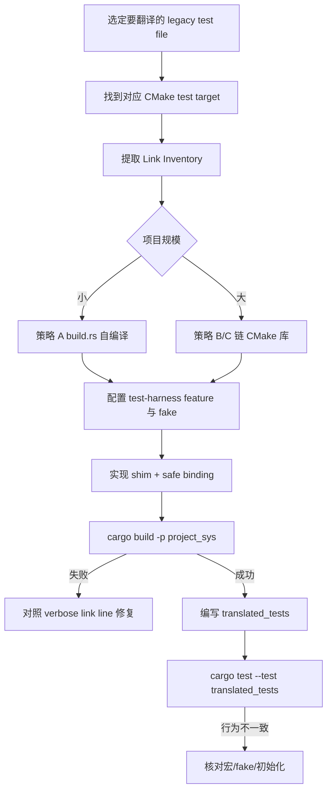

# Legacy 测试翻译场景：构建系统与链接指南

> **文档性质**：独立赋能文档，供工程师与 Agent 参考。  
> **适用场景**：原 C/C++ 测试依赖 CMake / Meson / Make 等构建系统，且需链接特定库才能运行；将测试翻译为 Rust `translated_tests` 后，如何在 Cargo 侧复现等价的编译与链接环境。  
> **关联文档**：[Mock/Stub Rust 侧处理指南](./legacy-translate-mock-stub-guide.md)（mock 与 fake 的链入方式见该文档 M1/M3 章节）。  
> **与 skill 的关系**：本文档解释方法论与操作细节；不修改、不绑定任何 skill 流程文件。

---

## 1. 问题定义

### 1.1 现象

原 legacy 测试通常通过构建系统执行，例如：

```bash
cmake --build build --target config_test
./build/tests/config_test
```

该 test target 往往：

- 编译被测模块 + 测试源文件 + fake/stub
- 链接项目静态库、第三方库、**gtest**、系统库（`pthread`、`stdc++`、`ssl` 等）
- 启用测试专用宏（`-DUNIT_TEST`、`-DUSE_FAKE_FS`）
- 配置专用 include 路径与生成头文件目录

翻译为 Rust 后：

```bash
cargo test -p project_rs --test translated_tests
```

**Cargo 不会自动继承 CMake test target 的链接配置。** 若 `{project}_sys` 未复现等价环境，会出现：

- 链接失败（undefined reference）
- 链接成功但行为不一致（宏/fake 缺失）
- 运行时加载动态库失败

### 1.2 第一性原则

| 原则 | 说明 |
|------|------|
| **链接责任在 `_sys`** | C/C++ 编译与链接由 `{project}_sys/build.rs`（或其所调用的 CMake）承担，不在 `{project}_rs` 直接链 C++ |
| **复现被测路径，非复现 gtest** | 对齐原 test target 对 **SUT（被测代码）** 的编译/链接，不必链接 gtest/gmock runner |
| **测试宏与 fake 必须对齐** | 原 test target 的 `-D` 与 fake 源文件是行为等价的关键 |
| **单一事实源** | 大型项目优先让 CMake 产出库，Rust 只链接；避免两套 build 长期漂移 |

### 1.3 职责划分

```text
┌─────────────────────────────────────────────────────────┐
│  project_rs / translated_tests                          │
│  - 只依赖 project_sys (path)                            │
│  - 编排 Rust 测试、断言、harness preset                 │
│  - 不直接 cc/link C++                                   │
└───────────────────────────┬─────────────────────────────┘
                            │ path dependency
┌───────────────────────────▼─────────────────────────────┐
│  project_sys                                            │
│  - build.rs：编译 legacy 源、shim、fake                 │
│  - bindgen + safe binding                               │
│  - cargo:rustc-link-lib=...                             │
└───────────────────────────┬─────────────────────────────┘
                            │ 等价于原 test target 对 SUT 的
                            │ compile + link（不含 gtest）
┌───────────────────────────▼─────────────────────────────┐
│  Legacy 构建系统（CMake / Meson / Make）                 │
│  - 可选：预先产出静态库供 Rust 链接                      │
└─────────────────────────────────────────────────────────┘
```

---

## 2. 从原 test target 提取「链接清单」

翻译或搭建 FFI 前，必须对原测试 target 做一次 **链接清单（Link Inventory）** 审计。

### 2.1 需要提取的项

| 类别 | 示例 | 写入 Rust 侧位置 |
|------|------|------------------|
| 静态/动态库 | `libconfig.a`, `libcrypto.so` | `build.rs` → `rustc-link-lib` |
| 系统库 | `pthread`, `stdc++`, `dl`, `m` | `build.rs` |
| 编译宏 | `USE_FAKE_FS`, `UNIT_TEST` | `cc::Build::define` |
| include 路径 | `include/`, `build/generated/` | `cc::Build::include` |
| 源文件（若自编译） | `config.c`, `parser.c` | `cc::Build::file` |
| 仅测试源 / fake | `tests/fake_fs.c` | 测试 build / feature 下编译 |
| C/C++ 标准 | `-std=c++17` | `cc::Build::std` |
| 链接搜索路径 | `-L/path/to/lib` | `rustc-link-search` |

### 2.2 CMake 项目提取方法

**方法 1：verbose 构建查看 link line**

```bash
cmake --build build --target config_test --verbose
# 或
ninja -C build -v config_test
```

从输出中找到 `Linking CXX executable config_test`，记录 `-l`、`-L`、`-D`。

**方法 2：CMake 脚本导出（推荐中大型项目）**

```cmake
# cmake/ExportTestDeps.cmake（示例）
get_target_property(_libs config_test LINK_LIBRARIES)
get_target_property(_defs config_test COMPILE_DEFINITIONS)
get_target_property(_incs config_test INCLUDE_DIRECTORIES)
message(STATUS "TEST_LINK_LIBS=${_libs}")
message(STATUS "TEST_COMPILE_DEFS=${_defs}")
```

或生成 JSON 供 `build.rs` 读取：

```cmake
# 自定义 target 导出 legacy_test_deps.json
```

**方法 3：compile_commands.json**

```bash
cmake -DCMAKE_EXPORT_COMPILE_COMMANDS=ON ...
```

用于核对单个翻译所需源文件的 `-D` 与 `-I`；**不能替代** link line（compile_commands 不含链接信息）。

### 2.3 Meson / Make 项目

| 构建系统 | 提取方式 |
|----------|----------|
| Meson | `meson compile -v` 查看 link；或 `meson introspect --targets` |
| Make | `make V=1 config_test` 查看完整命令 |
| Bazel | `bazel aquery` / `bazel cquery` 查 deps |

### 2.4 链接清单模板

```markdown
## Link Inventory: config_test

### 原构建目标
- 构建系统：CMake 3.20
- Target：`config_test`
- 原执行：`./build/tests/config_test`

### 链接库（不含 gtest）
- static: config_core, parser
- system: pthread, stdc++, dl

### 编译宏（test target 特有）
- USE_FAKE_FS=1
- UNIT_TEST=1

### Include
- legacy/include
- build/generated

### 仅测试源
- tests/support/fake_fs.c

### 不链接
- gtest, gmock, gtest_main

### Rust 映射策略
- [ ] 策略 A：build.rs 自编译
- [x] 策略 B：链接 CMake 产出 libconfig_under_test.a
```

---

## 3. 三种链接策略

### 3.1 策略 A：build.rs 自洽编译

**适用**：legacy 模块边界清晰、源文件数量有限、团队希望 `cargo test` 单命令闭环。

**做法**：在 `{project}_sys/build.rs` 中用 `cc` crate 编译全部必要 C/C++ 源 + shim + fake，并声明链接库。

```rust
// build.rs 示意
fn main() {
    let mut build = cc::Build::new();
    build
        .cpp(true)
        .std("c++17")
        .include("../legacy/include")
        .include("../legacy/build/generated")
        .define("UNIT_TEST", None)
        .define("USE_FAKE_FS", None)
        .file("../legacy/src/config.c")
        .file("../legacy/src/parser.c")
        .file("shim/config/config_ffi.cpp");

    if is_test_build() {
        build.file("tests/support/fake_fs.c");
    }

    build.compile("legacy_config");

    println!("cargo:rustc-link-lib=dylib=stdc++");
    println!("cargo:rustc-link-lib=pthread");

    // bindgen ...
}

fn is_test_build() -> bool {
    std::env::var("CARGO_CFG_TEST").is_ok()
        || std::env::var("CARGO_FEATURE_TEST_HARNESS").is_ok()
}
```

**优点**

- 不依赖先跑 CMake
- CI 步骤简单

**缺点**

- 与 CMake 双轨维护，易漂移
- 大型项目源文件列表难以手工同步

---

### 3.2 策略 B：先构建 Legacy，再链接已有产物（推荐大型项目）

**适用**：CMake 复杂、第三方多、已有成熟 test/静态库 target。

**核心思路**：从「只生成 gtest 可执行文件」改为「抽出可被 Rust 链接的库」。

#### CMake 侧改造（一次性）

```cmake
# 被测代码 + test 所需依赖，不含 gtest
add_library(config_under_test STATIC
    src/config.c
    src/parser.c
    tests/support/fake_fs.c
)
target_compile_definitions(config_under_test PRIVATE
    UNIT_TEST
    USE_FAKE_FS
)
target_include_directories(config_under_test PUBLIC
    include
    ${CMAKE_BINARY_DIR}/generated
)

# 原 gtest 可执行文件仍可保留
add_executable(config_test tests/config_test.cpp)
target_link_libraries(config_test
    config_under_test
    GTest::gtest GTest::gtest_main
)
```

#### Rust build.rs 链接静态库

```rust
fn main() {
    let legacy_build = std::path::Path::new("../legacy/build");

    println!("cargo:rustc-link-search=native={}", legacy_build.join("lib").display());
    println!("cargo:rustc-link-lib=static=config_under_test");
    println!("cargo:rustc-link-lib=dylib=stdc++");
    println!("cargo:rustc-link-lib=pthread");

    // 仅编译 shim（业务库已由 CMake 提供）
    cc::Build::new()
        .cpp(true)
        .include("../legacy/include")
        .file("shim/config/config_ffi.cpp")
        .compile("config_shim");

    println!("cargo:rerun-if-changed=../legacy/build/lib/libconfig_under_test.a");
}
```

#### CI 顺序

```bash
cmake -B legacy/build -DCMAKE_BUILD_TYPE=Debug
cmake --build legacy/build --target config_under_test
cargo test -p project_rs --test translated_tests
```

**优点**

- CMake 仍是编译宏、源文件、依赖的单一事实源
- Rust 侧 build.rs 较薄

**缺点**

- CI 两步；本地开发需记得先 build legacy
- 可在 `build.rs` 中检测库不存在并给出明确错误信息

---

### 3.3 策略 C：构建元数据桥接

**适用**：多 test target、频繁改 CMake、希望减少手工同步。

**做法**：

1. CMake 脚本生成 `legacy_test_deps.json`（libs、defines、includes、link_search）
2. `build.rs` 读取 JSON，设置 `cc` 与 `cargo:rustc-link-*`

```json
{
  "target": "config_test",
  "link_libraries": ["config_core", "parser"],
  "link_system": ["pthread", "stdc++"],
  "compile_definitions": ["UNIT_TEST", "USE_FAKE_FS"],
  "include_directories": ["include", "build/generated"],
  "test_only_sources": ["tests/support/fake_fs.c"]
}
```

```rust
// build.rs 片段
let deps: TestDeps = serde_json::from_str(&fs::read_to_string("legacy_test_deps.json")?)?;
for lib in deps.link_libraries {
    println!("cargo:rustc-link-lib=static={}", lib);
}
for def in deps.compile_definitions {
    build.define(def, None);
}
```

**优点**：可脚本化、可 diff、多 target 可复用  
**缺点**：需维护 JSON 生成逻辑

---

### 3.4 策略选择矩阵

| 条件 | 推荐策略 |
|------|----------|
| 小型 C 库、源文件 < 20 | A |
| 大型 CMake、第三方多 | B |
| 多 test target、频繁改构建 | C |
| 已有 `compile_commands.json` 仅用于核对宏/include | 辅助 A/C，不能替代 link |
| 嵌入式 cross-compile | B 或 A + 指定 triple |

---

## 4. translated_tests 侧配置

### 4.1 Cargo 工作区结构

```text
<workspace>/
├── Cargo.toml                 # [workspace] members = ["project_sys", "project_rs"]
├── legacy/                    # 原 C/C++ 项目（CMake 根）
├── project_sys/
│   ├── Cargo.toml
│   └── build.rs
└── project_rs/
    ├── Cargo.toml
    └── tests/
        ├── translated_tests.rs
        └── translated_cases/
```

### 4.2 project_rs 依赖写法

```toml
# project_rs/Cargo.toml
[package]
name = "project_rs"
version = "0.1.0"
edition = "2021"

[dependencies]
project_sys = { path = "../project_sys", features = ["test-harness"] }

[dev-dependencies]
# 通常不需要额外 C++ 链接库
```

**要点**：

- 所有 C/C++ 链接在 `project_sys` 完成
- 需要 fake/harness 时通过 **feature** 传递给 `_sys`，避免生产 build 链测试库

### 4.3 project_sys feature 门控

```toml
# project_sys/Cargo.toml
[features]
default = []
test-harness = []   # 启用 fake 源、测试宏、harness 模块
```

```rust
// build.rs
if std::env::var("CARGO_FEATURE_TEST_HARNESS").is_ok() {
    build.define("USE_FAKE_FS", None);
    build.file("tests/support/fake_fs.c");
}
```

`project_rs` 跑 translated 测试时始终启用 `test-harness`；若 `_rs` 仅 dev 测，也可只在 `[dev-dependencies]` 里开 feature（按项目定）。

### 4.4 运行命令

```bash
# 策略 B：先 legacy
cmake --build legacy/build --target config_under_test

# 跑全部翻译测试
cargo test -p project_rs --test translated_tests

# 跑单个
cargo test -p project_rs --test translated_tests test_translate_config_load_success

# 列出
cargo test -p project_rs --test translated_tests -- --list
```

---

## 5. 与原 test target 的差异对照

### 5.1 必须对齐

| 项 | 不对齐的后果 |
|----|-------------|
| 测试宏 `UNIT_TEST` | 条件编译代码路径不同，断言失败或链接缺符号 |
| fake/stub 源文件 | 依赖真实 IO/网络/HAL，测试不稳定 |
| 静态库成员 | undefined reference |
| `stdc++` / ABI | C++ shim 链接失败或运行时崩溃 |
| 生成头文件路径 | 编译失败或结构体布局不一致 |

### 5.2  deliberate 差异（允许）

| 项 | 说明 |
|----|------|
| gtest / gmock | Rust 测试替代，不链接 |
| gtest_main | 不需要 |
| 测试 .cpp 文件 | 已翻译为 Rust，不编译（除非其中有非测试的全局初始化 side effect——需个案分析） |

### 5.3 全局初始化与 constructor

若原测试依赖某 `.cpp` 中的全局构造函数或 `SetUpTestSuite`，需确认：

- 该初始化是否在被链入的 **库** 中（通常保留）
- 是否仅在 **test_main.cpp** 中（Rust 侧需补等价 setup 或链入必要初始化单元）

---

## 6. 动态库与 rpath

### 6.1 链接 .so

```rust
println!("cargo:rustc-link-search=native=/opt/legacy/lib");
println!("cargo:rustc-link-lib=dylib=legacy_vendor");
```

运行期：

```bash
LD_LIBRARY_PATH=/opt/legacy/lib cargo test -p project_rs --test translated_tests
```

Windows：`PATH` 或复制 DLL 到测试可执行文件旁。

### 6.2 优先静态链 test support

对 translated 测试，**优先静态链接** test support 与核心业务库，减少 CI/本地环境差异。动态库保留给确实需要 shared 的第三方。

### 6.3 rerun-if-changed

```rust
println!("cargo:rerun-if-changed=../legacy/build/lib/libconfig_under_test.a");
println!("cargo:rerun-if-changed=legacy_test_deps.json");
```

避免 legacy 重建后 Rust 侧仍用旧库。

---

## 7. 嵌入式与交叉编译

### 7.1 Host 单元测试（常见）

- translated 测试在 **开发机 host** 上跑
- 链 **host 版** fake HAL，不用 linker script
- `cargo test` 默认 host triple

### 7.2 Target 上跑（少见）

- 需 `cargo build --target armv7-unknown-linux-gnueabihf` 等
- legacy 库也需同 triple 交叉编译
- 通常 translated 测试仍放 host；设备上跑集成/系统测试

### 7.3 裸机 / 无 OS

- 若原「单元测试」在 host 用 fake 跑，translated 测试同样在 host
- 不要在 Cargo 里强行复现裸机链接脚本，除非明确要做 target 集成测

---

## 8. 与 Mock/Stub 文档的衔接

| Mock 策略 | 链接侧要求 |
|-----------|-----------|
| M1 link_fake | `fake_*.c` 必须在 test build 中编译并链入（与 CMake test target 一致） |
| M2 inject_ops | ops 实现通常在业务库或独立小库；setter 在 harness shim |
| M3 harness_api | weak HAL 覆盖依赖链接顺序；fake  object 需在真实 HAL 之前 |

**链接清单必须包含 fake/stub 源或库**，否则 mock 语义无法复现。详见 [legacy-translate-mock-stub-guide.md](./legacy-translate-mock-stub-guide.md)。

---

## 9. 故障排查

### 9.1 undefined reference to `foo`

```text
1. 对照 Link Inventory：foo 在哪个 .a / .o？
2. 该库是否 println!("cargo:rustc-link-lib=...")？
3. 是否因 UNIT_TEST 未定义导致 foo 未被编译进库？
4. C++ 符号是否缺少 extern "C" / 需链接 stdc++？
```

### 9.2 链接成功但断言失败

```text
1. 比较原 test target 与 build.rs 的 -D 宏
2. 确认 fake 是否链入（而非链了真实 HAL/FS）
3. 确认全局状态：原 SetUp vs Rust reset_all
4. 用同一输入分别跑 gtest 与 translated，二分差异
```

### 9.3 动态库加载失败

```text
1. ldd target/debug/deps/translated_tests-*（Linux）
2. 补 LD_LIBRARY_PATH 或改静态链
3. 检查 rustc-link-search 路径是否正确
```

### 9.4 CMake 与 Cargo 漂移

```text
1. 引入策略 B 或 C，单一事实源
2. CI 加一步：对比 legacy_test_deps.json 与 CMake 导出
3. build.rs 库缺失时 panic 并打印「请先 cmake --build ...」
```

---

## 10. 可执行工作流



### 10.1 交付前检查清单

- [ ] 已完成原 test target 的 Link Inventory
- [ ] 已明确策略 A / B / C
- [ ] gtest 未链入；业务库与 test 宏/fake 已对齐
- [ ] `cargo build -p project_sys` 无链接错误
- [ ] `project_rs` 不直接链 C++
- [ ] test-harness / fake 不进入生产默认 build
- [ ] CI 步骤顺序正确（若策略 B：先 CMake 后 cargo test）
- [ ] 动态库路径在 CI 与本地均已文档化
- [ ] 与原 gtest 至少抽样对比通过

---

## 11. CI 集成示例

```yaml
# 示意：GitHub Actions 片段
jobs:
  translated-tests:
    runs-on: ubuntu-latest
    steps:
      - uses: actions/checkout@v4

      - name: Build legacy test support lib
        run: |
          cmake -B legacy/build -DCMAKE_BUILD_TYPE=Debug
          cmake --build legacy/build --target config_under_test

      - name: Run translated tests
        run: cargo test -p project_rs --test translated_tests
        env:
          RUST_BACKTRACE: 1
          # 若需动态库：
          # LD_LIBRARY_PATH: ${{ github.workspace }}/legacy/build/lib
```

---

## 12. 反模式

| 反模式 | 问题 | 正确做法 |
|--------|------|----------|
| 在 `project_rs/build.rs` 链 C++ | 职责混乱、重复链接 | 全部在 `project_sys` |
| 只链 gtest 用过的 executable | 无法作为库链接 | 抽 `*_under_test` 静态库 |
| 忽略 test target 专用 `-D` | 行为分叉 | Link Inventory 必含宏 |
| 生产 build 默认开 fake | 污染发布物 | feature / cfg(test) |
| 手工维护巨大 file 列表且无 rerun | 静默用过期 .o | 策略 B 或 JSON + rerun-if-changed |
| 链接成功即认为等价 | 宏/fake 错仍可能绿 | 抽样对比原 gtest |

---

## 13. 附录

### 13.1 术语表

| 术语 | 含义 |
|------|------|
| Link Inventory | 从原 test target 提取的链接/编译清单 |
| SUT | 被测代码（不含 gtest） |
| config_under_test | 从 CMake 抽出的、供 test 与 FFI 共用的静态库 target 命名示例 |
| test-harness feature | Cargo feature，启用 fake 与测试宏 |

### 13.2 与 legacy-ffi / legacy-test-translate 的概念映射

| 本文档概念 | skill 中对应 | 关系 |
|-----------|-------------|------|
| build.rs 链接 | legacy-ffi Step 3 build.rs | 概念一致，本文档细化 test 场景 |
| 不链 gtest | test-translate 不迁移 runner | 一致 |
| fake 链入 | mock 指南 M1 | 互补 |
| Link Inventory | skill 未显式定义 | 本文档补充 |

### 13.3 进一步阅读

- [Mock/Stub Rust 侧处理指南](./legacy-translate-mock-stub-guide.md)
- Rust `cc` crate 文档
- CMake `target_link_libraries` / `INTERFACE` 库
- Rust Nomicon：FFI 与链接

---

## 文档版本

| 项 | 值 |
|----|-----|
| 版本 | 1.0.0 |
| 日期 | 2026-07-16 |
| 状态 | 独立赋能文档，与 skill 解耦 |
