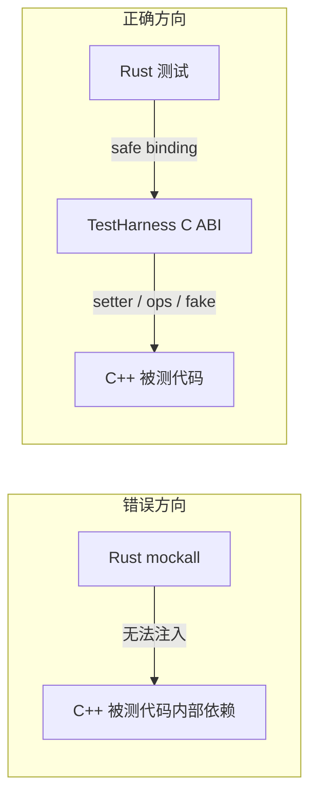
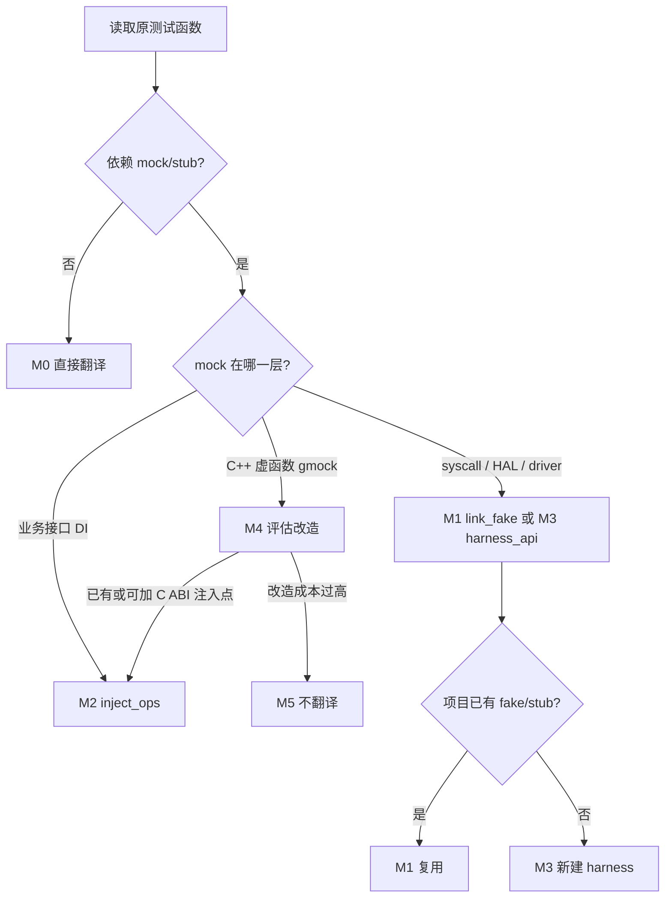
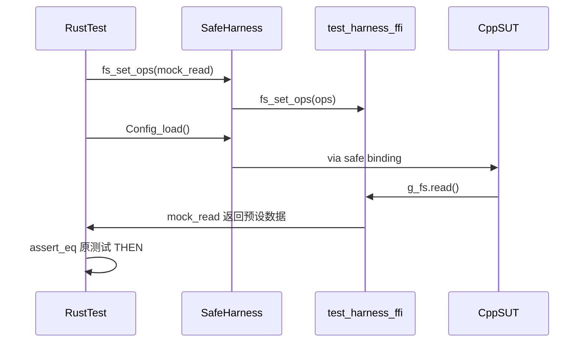
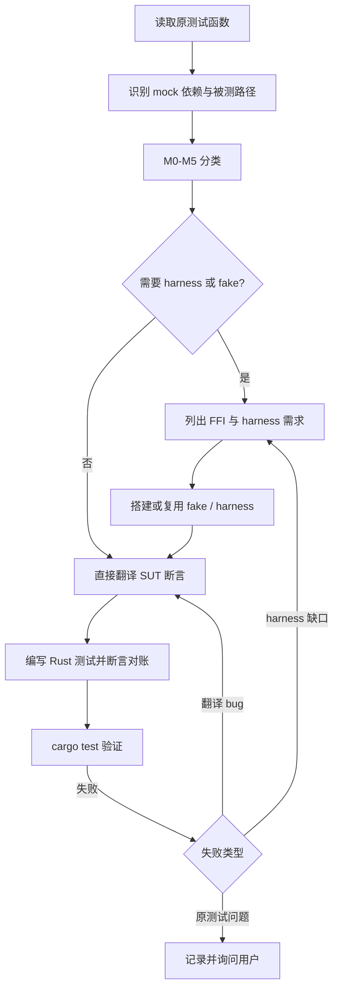

# Legacy 测试翻译场景：Mock/Stub 的 Rust 侧处理指南

> **文档性质**：独立赋能文档，供工程师与 Agent 参考。  
> **适用场景**：将 C/C++ legacy 测试（gtest / Unity / assert）语义翻译为 Rust 测试，并通过 FFI safe binding 验证同一 C/C++ 后端行为。  
> **与 skill 的关系**：本文档解释方法论与操作细节；不修改、不绑定任何 skill 流程文件。

---

## 1. 背景与第一性原理

### 1.1 test-translate 要达成什么

测试翻译（test-translate）的目标**不是**把 gtest 语法逐行翻成 Rust，而是：

| 目标 | 含义 |
|------|------|
| **同一被测对象（SUT）** | 仍验证 C/C++ legacy 后端，经 safe binding 调用，不是 Rust 重写版 |
| **同一可观察行为** | Given / When / Then 语义与原测试一致 |
| **断言可对账** | Rust 中由原始断言翻译而来的断言数量，与原测试可对账 |
| **expected 同源** | 来自原测试（含 mock 预设的返回值与副作用），不得猜测或弱化 |

翻译后的 Rust 测试是一条验证链路：

```text
Rust 测试
  → {project}_sys safe binding
  → C ABI shim（必要时）
  → C/C++ legacy 被测代码
  → （可能经过 mock/stub 依赖）
  → Rust 断言
```

### 1.2 mock 解决什么问题

mock / stub / fake 解决的是**依赖隔离**：

- 文件系统、网络、数据库、硬件外设不可控
- 真实环境不稳定、不可重复、成本高
- 需要覆盖错误分支，但真实依赖很难触发

mock 的本质：**在测试中用一个可控的假依赖，替换真实外部依赖**。

### 1.3 第一性约束：从 translate 目标推导 mock 处理原则

| 必须保留 | 不必保留 |
|----------|----------|
| mock 对**被测路径**造成的输入、状态、返回值效果 | gmock `EXPECT_CALL` 框架本身 |
| 原测试中对 **SUT 结果** 的断言 | 对 mock 对象「是否被调用」的框架级验证（除非它等价于 SUT 可观察行为） |
| 可重复、可控的依赖边界 | C++ 虚函数 mock 对象的 vtable 与内存布局 |

**核心结论**：

> Rust 侧不重建 C++ mock 框架；只重建 **mock 注入语义**——让 C/C++ 被测代码在测试中走到与原测试相同的依赖行为。

### 1.4 正确方向 vs 错误方向



**错误方向**：在 Rust 侧用 `mockall` 等框架模拟依赖，但注入点仍在 C++ 内部——Rust 够不着，被测路径已变。

**正确方向**：把 mock 注入点**下沉到 C ABI 边界**，Rust 通过 harness / ops / link-time fake 控制 C/C++ 被测代码实际走到的依赖行为。

---

## 2. Mock 原理速览

### 2.1 Test Double 家族

口语中「mock」常混指多种测试替身，严格分类如下：

| 类型 | 作用 | 典型场景 |
|------|------|----------|
| **Stub** | 固定返回预设值 | `read()` 永远返回 `"mode=test"` |
| **Fake** | 简化但可用的实现 | 内存文件系统、内存数据库 |
| **Mock** | 预设行为 + 验证调用方式 | `EXPECT_CALL(send).Times(1)` |
| **Spy** | 真实对象 + 记录调用 | 统计某函数被调几次 |

翻译场景下，**工程里最常见的是 stub 和 fake**；严格意义的 gmock mock（验证调用序列）往往最难直接翻译。

### 2.2 三种注入点

mock 能否在 Rust 翻译测试中复现，取决于**注入点在哪一层**：

```text
┌─────────────────────────────────────┐
│  业务模块（被测代码 SUT）              │
├─────────────────────────────────────┤
│  业务接口层（Storage / Transport）   │  ← 注入点 B：ops 表 / 虚函数 DI
├─────────────────────────────────────┤
│  平台抽象层（HAL / Driver API）       │  ← 注入点 C：weak symbol / harness
├─────────────────────────────────────┤
│  系统调用层（open/read/socket/寄存器）│  ← 注入点 A：链接期 fake
└─────────────────────────────────────┘
```

| 注入点 | 典型 mock 对象 | Rust 侧最顺手的策略 |
|--------|---------------|---------------------|
| A 系统调用层 | `open` / `read` / `socket` | M1 链接期 fake |
| C HAL 层 | `hal_uart_send` / 寄存器读写 | M1 或 M3 harness |
| B 业务接口层 | `IStorage` / `INetwork` | M2 ops 注入 |

### 2.3 为什么 C++ 虚函数 mock 无法直接在 Rust 侧复刻

C++ gmock 典型写法：

```cpp
class MockStorage : public Storage {
public:
    MOCK_METHOD(int, read, (int id), (override));
};

TEST(Foo, Bar) {
    MockStorage storage;
    EXPECT_CALL(storage, read(42)).WillOnce(Return(100));
    Foo foo(storage);  // 注入点在 C++ 对象层
    EXPECT_EQ(foo.run(), 100);
}
```

问题在于：

1. **C++ class / vtable 不能稳定跨 FFI**
2. **注入发生在 C++ 构造函数参数**，Rust 侧无法「塞一个 MockStorage 对象」进去
3. **`EXPECT_CALL` 验证的是 mock 框架内部状态**，不是 SUT 的可观察输出

因此，gmock 重度测试需要 **M4 策略**：要么改造为 C ABI 可注入（M2/M3），要么保留 C++ 测试不翻译。

---

## 3. Mock 分类体系（M0–M5）

### 3.1 分类表

| 类型 | 名称 | 原测试特征 | Rust 侧策略 |
|------|------|-----------|-------------|
| **M0** | none | 无 mock，直接调 SUT | 直接翻译 |
| **M1** | link_fake | 链入 `fake_fs` / `fake_hal` / stub syscall | 复用 C fake，Rust 通常无感知 |
| **M2** | inject_ops | 函数指针表 / 可注入 ops | Rust `extern "C" fn` + `set_ops()` |
| **M3** | harness_api | 项目已有 test hook / weak HAL | harness safe API 预设行为 |
| **M4** | cpp_mock | gmock 虚对象 + `EXPECT_CALL` 时序 | 评估上游改造，或保留 C++ 测试 |
| **M5** | not_translatable | 纯 mock 基础设施、无 SUT 行为 | 不翻译，保留原测试或跳过 |

### 3.2 决策树



### 3.3 策略选择矩阵

| 场景 | 推荐策略 | 说明 |
|------|----------|------|
| 嵌入式文件系统 mock | M1 | 链入 `fake_fs.c`，业务代码无感 |
| 嵌入式 UART/SPI/Flash | M1 或 M3 | weak HAL 或 fake driver |
| 业务模块依赖注入（C 风格） | M2 | ops 表 + Rust 函数指针 |
| 业务模块依赖注入（C++ 虚函数） | M4 → M2 | 需先抽 C ABI 包装或 ops 表 |
| 纯 `EXPECT_CALL` 验证、无 SUT 断言 | M5 | mock-only，无翻译价值 |
| 网络 mock（socket 层） | M1 | 链入 fake socket |
| 参数化 + mock 混合 | 按层拆分 | SUT 断言翻译，mock 框架断言丢弃 |

### 3.4 默认优先级

1. **优先**：复用 legacy 已有 fake / stub / weak HAL（M1 / M3）
2. **其次**：通过 shim 暴露 test harness API（M3），尽量不改业务逻辑
3. **再次**：输出「最小可测性改造清单」，经确认后做 ops 表（M2，M4 降级路径）
4. **禁止**：在 `{project}_rs` 直接声明 `extern "C"` 绕过 safe binding；禁止 Rust mockall 假装替代 C++ 内部未暴露依赖

---

## 4. 架构：Test Harness 与 crate 分工

### 4.1 推荐目录结构

```text
<workspace>/
├── {project}_sys/
│   ├── build.rs
│   ├── shim/
│   │   ├── src/parser/config_ffi.{h,cpp}      # 业务 shim
│   │   └── test_harness/test_harness_ffi.{h,cpp}  # harness shim
│   ├── src/
│   │   ├── src/parser/config.rs               # 业务 safe binding
│   │   └── test_harness/                      # cfg(test) 或 feature
│   │       ├── mod.rs                         # reset_all()
│   │       ├── fs.rs
│   │       └── hal.rs
│   └── tests/support/                         # 仅测试链接的 C fake
│       └── fake_fs.c
└── {project}_rs/
    └── tests/
        ├── translated_tests.rs
        └── translated_cases/
            └── tests/config_test_translated.rs
```

### 4.2 四层职责

| 层 | 位置 | 职责 |
|----|------|------|
| C fake / weak override | `_sys/tests/support` 或 legacy 已有 | 替换底层 syscall / HAL 实现 |
| C ABI harness setter | `_sys/shim/test_harness_ffi.*` | 暴露注入点给 bindgen |
| safe harness API | `_sys/src/test_harness/` | Rust 测试可调用的 reset / preset / set_ops |
| 测试编排 | `_rs/tests/translated_cases/` | 翻译 setup + SUT 调用 + 断言 |

### 4.3 生产 vs 测试隔离

test harness **不得泄漏到生产 API 面**：

```rust
// {project}_sys/src/lib.rs

pub mod config;  // 生产 safe API

#[cfg(any(test, feature = "test-harness"))]
pub mod test_harness;
```

`build.rs` 中，fake 源文件仅在测试配置下编译：

```rust
// 伪代码示意
if env::var("CARGO_CFG_TEST").is_ok() {
    build.file("tests/support/fake_fs.c");
}
```

或通过 Cargo feature：

```toml
[features]
test-harness = []
```

### 4.4 M2 数据流时序



---

## 5. 三种核心模式详解

### 5.1 M1：链接期 Fake（嵌入式文件系统）

#### 适用场景

- mock 的是系统调用或 HAL 底层（`open` / `read` / `hal_flash_read`）
- 原项目已有或易于添加 C fake 源文件
- 业务代码不感知 fake 存在

#### C 侧 fake

```c
// tests/support/fake_fs.c
#include <string.h>

static char g_fake_content[256];

void fake_fs_set_content(const char* content) {
    strncpy(g_fake_content, content, sizeof(g_fake_content) - 1);
}

void fake_fs_reset(void) {
    g_fake_content[0] = '\0';
}

int fs_open(const char* path, int flags) {
    (void)flags;
    if (strcmp(path, "/etc/app.conf") != 0) return -1;
    return 1;
}

int fs_read(int fd, void* buf, int n) {
    (void)fd;
    int len = (int)strlen(g_fake_content);
    if (len > n) len = n;
    memcpy(buf, g_fake_content, len);
    return len;
}

int fs_close(int fd) {
    (void)fd;
    return 0;
}
```

#### build.rs 测试链接

```rust
// build.rs 片段：测试 build 时链入 fake
let mut build = cc::Build::new();
build.file("shim/src/config/config_ffi.cpp");

if std::env::var("CARGO_CFG_TEST").is_ok() {
    build.file("tests/support/fake_fs.c");
}

build.compile("legacy_config");
```

#### harness reset API（可选但推荐）

```c
// shim/test_harness/test_harness_ffi.h
#pragma once
#ifdef __cplusplus
extern "C" {
#endif
void test_harness_reset_all(void);
void test_harness_fs_preset(const char* content);
#ifdef __cplusplus
}
#endif
```

#### Rust 翻译测试

```rust
// tests/translated_cases/tests/config_test_translated.rs
// Translated from gtest: ConfigTest.LoadSuccess
// Source: tests/config_test.cpp:42-58
// Assertion Count: 2

use my_project_sys::{Config, test_harness};

#[test]
fn test_translate_config_test_load_success() -> Result<(), my_project_sys::ConfigError> {
    // SetUp: fake_fs preset "/etc/app.conf" -> "mode=1"
    test_harness::reset_all()?;
    test_harness::fs_preset(b"mode=1")?;

    // auto cfg = Config::Load();
    // ASSERT_TRUE(cfg.ok());
    let cfg = Config::load()?;

    // EXPECT_EQ(cfg.mode(), 1);
    assert_eq!(cfg.mode()?, 1);

    // EXPECT_TRUE(cfg.IsValid());
    assert!(cfg.is_valid()?);

    Ok(())
}
```

**要点**：

- `fs_preset` / `reset_all` 用 `?` 或非 assert 控制流，**不计入 Assertion Count**
- 原 `EXPECT_CALL` 不翻译；其语义已通过 fake 预设体现
- SUT 断言必须完整翻译

---

### 5.2 M2：函数指针注入（业务接口 DI）

#### 适用场景

- 业务代码通过函数指针表或 ops 结构体调用依赖
- 或可改造为 ops 表（M4 降级路径）
- 需要在 Rust 侧按测试用例切换不同 mock 行为

#### C 侧 ops 表

```c
// config_deps.h
typedef struct {
    int (*read)(const char* path, char* buf, int n);
    int (*write)(const char* path, const char* buf, int n);
} fs_ops_t;

extern fs_ops_t g_fs;
void fs_set_ops(const fs_ops_t* ops);

// config.c
fs_ops_t g_fs;

int config_load(Config* out) {
    char buf[128];
    int n = g_fs.read("/etc/app.conf", buf, sizeof(buf));
    if (n < 0) return -1;
    return parse_config(out, buf, n);
}
```

#### shim 暴露 C ABI

```c
// shim/test_harness/test_harness_ffi.h
typedef int (*fs_read_fn)(const char* path, char* buf, int n);

typedef struct {
    fs_read_fn read;
    fs_read_fn write;  // 简化示例
} fs_ops_view_t;

void test_harness_fs_set_ops(const fs_ops_view_t* ops);
void test_harness_reset_all(void);
```

#### Rust mock 函数

```rust
use std::cell::RefCell;
use my_project_sys::test_harness::{self, FsOpsView};

thread_local! {
    static MOCK_CONTENT: RefCell<Vec<u8>> = RefCell::new(Vec::new());
}

extern "C" fn mock_read(_path: *const std::os::raw::c_char,
                        buf: *mut std::os::raw::c_char,
                        n: std::os::raw::c_int) -> std::os::raw::c_int {
    MOCK_CONTENT.with(|data| {
        let bytes = data.borrow();
        let len = bytes.len().min(n as usize);
        unsafe {
            std::ptr::copy_nonoverlapping(bytes.as_ptr(), buf as *mut u8, len);
        }
        len as i32
    })
}

extern "C" fn mock_write(_path: *const std::os::raw::c_char,
                         _buf: *const std::os::raw::c_char,
                         _n: std::os::raw::c_int) -> std::os::raw::c_int {
    -1  // 本测试不涉及 write
}
```

#### Rust 翻译测试

```rust
#[test]
fn test_translate_config_test_read_failure() -> Result<(), my_project_sys::ConfigError> {
    test_harness::reset_all()?;

    // EXPECT_CALL(fs, read("/etc/app.conf", _, _)).WillOnce(Return(-1));
    MOCK_CONTENT.with(|d| d.borrow_mut().clear());
    let ops = FsOpsView {
        read: mock_read,
        write: mock_write,
    };
    test_harness::fs_set_ops(&ops)?;

    // EXPECT_EQ(Config::Load(), CONFIG_ERR_IO);
    let ret = my_project_sys::Config::load();
    let err = ret.expect_err("Load should fail with IO error");
    assert_eq!(err.code(), my_project_sys::ConfigErrorCode::Io);

    Ok(())
}
```

**要点**：

- Rust `extern "C" fn` 作为 mock 实现，通过 ops 注入 C 侧
- 错误码断言必须绑定被测 API 的 `Result`，不能用常量伪造
- 每个测试开头 `reset_all()` 隔离全局 ops 状态

---

### 5.3 M3：Harness API（HAL weak symbol / test hook）

#### 适用场景

- HAL 函数已是 weak symbol，或项目有 test hook 机制
- 需要在测试中预设硬件行为，但不想改业务代码

#### C 侧 weak HAL

```c
// hal_uart.c
__attribute__((weak))
int hal_uart_send(const uint8_t* data, int len) {
    return real_hw_uart_send(data, len);
}
```

#### 测试链接 fake HAL

```c
// tests/support/fake_hal_uart.c
#include <string.h>

static uint8_t g_sent[256];
static int g_sent_len;

int hal_uart_send(const uint8_t* data, int len) {
    g_sent_len = len > 256 ? 256 : len;
    memcpy(g_sent, data, g_sent_len);
    return g_sent_len;
}

void fake_hal_uart_reset(void) {
    g_sent_len = 0;
}

const uint8_t* fake_hal_uart_sent(int* out_len) {
    *out_len = g_sent_len;
    return g_sent;
}
```

#### harness API 暴露查询能力

```c
// test_harness_ffi.h
void test_harness_reset_all(void);
const uint8_t* test_harness_uart_sent(int* out_len);
```

#### Rust 翻译测试

```rust
#[test]
fn test_translate_protocol_test_send_at_command() -> Result<(), my_project_sys::ProtocolError> {
    test_harness::reset_all()?;

    // protocol_send("AT\r\n");
    my_project_sys::protocol_send(b"AT\r\n")?;

    // EXPECT_EQ(hal_uart_sent(), "AT\r\n");
    let sent = test_harness::uart_sent()?;
    assert_eq!(sent, b"AT\r\n");

    Ok(())
}
```

**要点**：

- weak symbol 覆盖在链接期完成，Rust 侧通过 harness 查询 fake 状态
- 若原测试只断言 SUT 返回值、不断言 HAL 侧数据，则不必暴露 `uart_sent`

---

## 6. 断言对账规则（mock 场景专用）

### 6.1 计入「应翻译断言数」

- 原测试对 **SUT 返回值、状态、输出** 的 `EXPECT_*` / `ASSERT_*`
- helper 内**直接验证 SUT 行为**的断言
- 参数化测试展开后，每个 case 中对 SUT 的断言

### 6.2 不计入

- `EXPECT_CALL(...).Times(1)` 等**纯 mock 交互验证**（与 SUT 可观察输出无关）
- harness 的 `reset_all()`、`fs_preset()`、ops 注入（用 `?` 或非 assert 控制流）
- Rust 为资源安全追加的辅助检查（不得使用 `assert*` 宏）

### 6.3 混合测试的拆分

原测试同时包含 SUT 断言与 mock 框架断言时：

```cpp
TEST(Foo, Bar) {
    EXPECT_CALL(mock, read(42)).Times(1);   // mock 框架断言 → 不翻译
    EXPECT_EQ(foo.run(), 100);              // SUT 断言 → 翻译
    EXPECT_TRUE(foo.is_ready());            // SUT 断言 → 翻译
}
```

- **Assertion Count = 2**（不是 3）
- mock 预设语义通过 harness / fake 在 setup 段复现
- 在测试注释或 Manifest Reason 中说明拆分依据

### 6.4 错误码断言模板（mock 场景）

原测试：

```cpp
// EXPECT_EQ(Config::Load(), CONFIG_ERR_IO);
```

Rust 正确写法：

```rust
let ret = my_project_sys::Config::load();
let err = ret.expect_err("Load should fail with IO error");
assert_eq!(err.code(), my_project_sys::ConfigErrorCode::Io);
```

禁止写法：

```rust
// 错误：? 提前返回，断言未执行
my_project_sys::Config::load()?;
let ret = my_project_sys::ConfigErrorCode::Io;
assert_eq!(ret, ...);

// 错误：断言常量而非被测 API 返回值
let ret = Err(my_project_sys::ConfigError::Io);
assert!(matches!(ret, Err(_)));
```

---

## 7. 可执行工作流

### 7.1 流程总览



### 7.2 分步说明

| 步骤 | 输入 | 动作 | 输出 / 停止条件 |
|------|------|------|-----------------|
| 1 读取 | 原测试函数体、fixture、helper | 列出所有外部依赖调用 | 依赖清单 |
| 2 分类 | 依赖清单 | 判定 M0–M5 | Mock Strategy |
| 3 拆分断言 | 原测试断言列表 | 区分 SUT 断言 vs mock 框架断言 | Assertion Count |
| 4 FFI 需求 | M1/M2/M3 分类结果 | 列出业务 API + harness API + fake 源文件 | FFI 需求清单 |
| 5 搭建 harness | FFI 需求清单 | 实现或复用 fake / ops / harness | harness 可用 |
| 6 翻译 | spec 化后的 Given/When/Then | 写 Rust 测试，setup 用 harness，Then 用 assert | 测试代码 |
| 7 验证 | 测试代码 | `cargo test` + 断言数量对账 | 通过或进入失败分类 |

### 7.3 FFI 需求清单模板

```markdown
## 测试：<Suite>.<TestName>
- 原文件：tests/config_test.cpp:42-58
- Mock Strategy：M2 inject_ops
- 业务 safe binding：
  - Config::load()
  - Config::mode()
  - Config::is_valid()
- Harness API：
  - test_harness::reset_all()
  - test_harness::fs_set_ops()
- C fake / shim：
  - shim/test_harness/test_harness_ffi.{h,cpp}
  - config 模块 ops 表（若尚未存在）
- Assertion Count：2
- Mock setup 步数：1（fs preset via ops）
```

---

## 8. 边界场景与处置

### 8.1 gmock EXPECT_CALL 时序复杂

**特征**：大量 `InSequence`、`WillOnce` 链、`Times(Exactly(3))` 等。

**处置**：

1. 评估能否将 mock 依赖改为 ops 表（M4 → M2）
2. 若改造成本高于测试价值 → **保留 C++ 测试**（M5）
3. 若 SUT 断言可独立提取 → 只翻译 SUT 部分，mock 时序不翻译

### 8.2 嵌入式 HAL mock

**特征**：UART、SPI、Flash、GPIO 寄存器 mock。

**处置**：

- 优先 M1：复用项目已有 fake driver
- 其次 M3：weak HAL + harness 查询
- 新建 fake 时，放在 `_sys/tests/support/`，仅测试链接

### 8.3 全局状态 / 环境变量

**特征**：原测试依赖全局变量、单例、环境变量。

**处置**：

- 每个测试开头 `test_harness::reset_all()`
- 若 legacy 代码无法 reset → 标记为阻塞，列出需补充的 reset API
- 不得用 `#[serial_test]` 等方式绕过隔离问题而不解决根因

### 8.4 mock 占比超过 50%

**特征**：大部分测试都是 mock 重度依赖。

**处置（分层策略）**：

```text
第 1 批：无 mock 的纯逻辑测试 → 直接翻译（M0）
第 2 批：系统/HAL mock → M1/M3
第 3 批：业务 DI mock → M2（必要时 ops 改造）
第 4 批：gmock 时序 mock → 保留 C++ 或评估改造
```

若整体 mock 测试质量差、难以复现真实行为，可考虑**改走 spec 驱动路径**（从源码建模行为，而非翻译 mock 测试）。

### 8.5 无注入点且不可改 C/C++

**处置**：

- **不硬翻**
- 输出「最小可测性改造清单」，例如：
  - 将 `Storage*` 改为 `fs_ops_t` 注入
  - 将 `hal_uart_send` 改为 weak symbol
  - 添加 `test_harness_reset_all()` 入口
- 经用户确认后再继续

---

## 9. 反模式清单

| 反模式 | 为什么错 | 正确做法 |
|--------|----------|----------|
| Rust mockall 替代 C++ 内部依赖 | 注入点不在 C ABI，SUT 路径已变 | M2 ops 注入或 M1 link fake |
| 弱化断言让测试通过 | 失去等价性验证意义 | 保持原断言语义，或标记阻塞 |
| 翻译 EXPECT_CALL 当作 SUT 断言 | 验证的是 mock 框架，不是 SUT | 拆分断言，mock 语义放 setup |
| 生产 API 暴露 test harness | 泄漏测试代码到生产 | `cfg(test)` 或 feature gate |
| 绕过 safe binding 直接 `extern "C"` | 破坏 FFI 边界约束 | 通过 `_sys` harness safe API |
| 用常量伪造错误码断言 | 未验证被测 API 真实返回 | `let ret = api(); assert on ret` |
| 多个测试共享 fake 全局状态不 reset | 测试间污染 | 每测试 `reset_all()` |

---

## 10. 检查清单（交付前自检）

### 10.1 分析与分类

- [ ] 已识别原测试所有 mock/stub 依赖
- [ ] 已判定 Mock Strategy（M0–M5）
- [ ] 已拆分 SUT 断言与 mock 框架断言
- [ ] Assertion Count 已明确且可对账

### 10.2 架构与 harness

- [ ] 注入点位于 C ABI 边界（A / B / C 层之一）
- [ ] harness / fake 不进入生产 build
- [ ] 每个测试有 `reset_all()` 或等价隔离
- [ ] ops / fake 状态不在测试间泄漏

### 10.3 翻译质量

- [ ] 只通过 safe binding 调用 C/C++ 行为
- [ ] setup 段复现 mock 语义（非翻译 mock 框架）
- [ ] 所有 SUT 断言已翻译，未弱化
- [ ] 错误码断言绑定被测 API 返回值

### 10.4 验证

- [ ] `cargo test --test translated_tests <fn>` 通过
- [ ] 测试出现在 `-- --list` 输出中
- [ ] Rust 中断言数量 = Assertion Count
- [ ] 失败时已区分：翻译 bug / harness 缺口 / 原测试问题

---

## 11. 附录

### 11.1 术语表

| 术语 | 含义 |
|------|------|
| SUT | System Under Test，被测模块 |
| safe binding | `{project}_sys` 暴露的 Rust 安全封装 API |
| harness | 测试注入层，提供 reset / preset / set_ops 等 |
| Assertion Count | 原测试中应翻译为 Rust 断言的数量 |
| inject_ops | 通过函数指针表注入 mock 实现 |
| link_fake | 链接期用 C fake 源文件替换真实实现 |

### 11.2 与 legacy-test-translate / legacy-ffi 的概念映射

| 本文档概念 | skill 中对应概念 | 关系 |
|-----------|-----------------|------|
| Mock Strategy M0–M5 | 当前 skill 未显式定义 | 本文档补充的方法论 |
| Assertion Count | TRANSLATION_MANIFEST Details 字段 | 概念一致 |
| harness API | translation-origin FFI request 可涵盖的目标 | 本文档扩展了 request 范围 |
| M5 not_translatable | `skipped: mock-only:` / `external-env:` | 处置方向一致 |
| safe binding | `{project}_sys` 公开 API | 概念一致 |

本文档**不修改** skill 流程；若 skill 未来吸收本文档内容，以 skill 版本为准。

### 11.3 进一步阅读

- Test Double 分类：Gerard Meszaros, *xUnit Test Patterns*
- C ABI 与 FFI 边界：Rust Nomicon - FFI chapter
- 嵌入式测试：CMock / FFF (Fake Function Framework) 文档
- Legacy 迁移路径：本仓库 README「Legacy 路径」章节

---

## 文档版本

| 项 | 值 |
|----|-----|
| 版本 | 1.0.0 |
| 日期 | 2026-07-16 |
| 状态 | 独立赋能文档，与 skill 解耦 |
