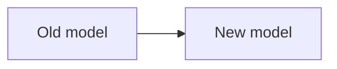

# C/C++ → Rust 重构价值分析

## 1. Executive Summary

用面向架构师/技术管理者的语言总结最重要的发现。不要限制发现数量，但优先呈现最有影响的变化。

回答：
- 整个系统最根本的设计变化是什么？
- 重构创造了哪些主要工程价值？
- 哪些价值明显由 Rust 的设计模型、类型系统、ownership 或并发模型驱动/保证？
- 哪些仍然属于语言无关的优秀重新设计？
- 是否存在显著 trade-off 或剩余风险？

## 2. 分析范围与方法

- Old C/C++ revision/path:
- New Rust revision/path:
- migration range:
- repository scale:
- tools used:
- evidence limitations:

说明只对重要/典型案例做深度分析，而不是平均审计所有代码。

## 3. 系统级 Before / After

### 3.1 旧 C/C++ 系统设计

### 3.2 新 Rust 系统设计

### 3.3 核心变化

可使用 Mermaid：

## 4. 价值地图

| 价值 | 相关核心案例 | 主要来源 | 影响范围 |
|---|---|---|---|
| ... | ... | General redesign / Rust-driven design / type system / ownership / concurrency | ... |

此表只作为导航；详细论证必须在案例章节展开。

## 5. 典型案例分析

> 案例数量不设固定上限。Critical/Major 案例详细写，Supporting 案例可以更短。

### Case 1 — ...

使用 `CASE_TEMPLATE.md` 的结构。

### Case 2 — ...

...

## 6. 跨案例的系统性价值

### 6.1 架构与模块边界

### 6.2 Ownership / 生命周期模型

### 6.3 状态与类型建模

### 6.4 无畏并发与并发设计

### 6.5 Error / API contract

### 6.6 Unsafe / FFI 边界

只写实际存在并有多个案例支持的主题；不要为了模板完整而硬凑章节。

## 7. Rust 驱动的设计变化

重点回答：哪些设计并非简单“先设计好再由 Rust 加保证”，而是 Rust 的模型本身推动形成了新的架构、状态模型、ownership 或 concurrency 方案？

## 8. 与语言无关的重构价值

明确指出那些即使使用 C++ 重新实现也依然成立的架构/模块/API/测试价值。

## 9. Trade-offs 与剩余风险

例如：
- Arc/Mutex/clone/分配成本
- async complexity
- unsafe/FFI obligations
- migration compatibility layers
- build/dependency costs
- missing tests or unresolved mappings

## 10. 总结

不要写成 Rust 宣传稿。总结“这次重构究竟改变了什么工程现实”。
