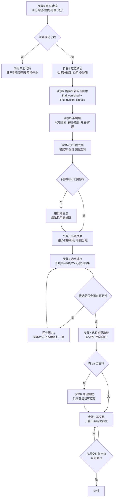

# rust-refactor-value-report

把一次 C/C++ → Rust 的重写，转化成一份**经得起技术评审追问的详细价值分析文档**。

版本 2.0 · 输入：两份现存代码库 · 输出：一份叙述性 Markdown 文档

## 做什么

**主线是当前两份代码的比对**，git 历史与缺陷记录只作可选加权。挖掘按**六个优势方面 × 四个深度层次**展开，写作受**五条铁律**约束，交付物是一份叙述性文档。

产出应满足三条：每个价值点以新设计为主语、指向具体代码位置、附带代价。

## 流程



每步的完成标志、分支条件与"卡住时怎么办"见 `SKILL.md` 的执行清单。

## 快速开始

```bash
# 先跑指向新实现的两个，让主体章节有"新设计"可写
python scripts/find_vanished.py       --old <cpp> --new <rust>/src   # 消失了什么
python scripts/find_design_signals.py --new <rust>/src               # 出现了什么

# 定位与加权
python scripts/rank_core_symbols.py --old <cpp>/src --repo <cpp>
python scripts/find_change_cost.py  --repo <cpp>
python scripts/mine_fix_commits.py  --repo <cpp>
python scripts/code_metrics.py      --old <cpp> --new <rust>
```

然后按 `SKILL.md` 的执行流程走 0-7 步。

## 包内容

| 文件 | 用途 | 流程 |
|---|---|---|
| `SKILL.md` | 主线、五条铁律、优势六方面 × 挖掘四层、选点判据、归因、流程、术语 | 全程常驻 |
| `references/scope-and-core.md` | 事实基线、规模分流、主干数据流法、数据流四问、对应关系表 | 0-1 |
| `references/layer-architecture.md` | 状态归属、依赖方向、模块边界、并发拓扑、扩展机制 | 2 |
| `references/layer-patterns.md` | 设计意图五问、无档案时的反推五法、11 类模式对照库 | 3 |
| `references/layer-invariants.md` | 四种归宿、根因分组、台账、承载机制表 | 4 |
| `references/evidence.md` | 对照选取与格式、高频速查、反向自查、六个脚本用法与纪律 | 5-6 |
| `references/write-report.md` | 文档结构、开篇写法、各章要求、八项交付前自查 | 7 |

## 脚本接口

统一参数：`--old`（C/C++）、`--new`（Rust）、`--repo`（git 仓库）、`--top`、`--json`。`--root`、`--show` 作为别名保留。

| 脚本 | 方向 | 作用 |
|---|---|---|
| `find_vanished.py` | 新旧对比 | 旧实现有、新实现无对应物的机制，按扇入排序 |
| `find_design_signals.py` | 新实现 | 20 类设计信号候选，每条附追问入口；含未出现信号与体检数字 |
| `rank_core_symbols.py` | 旧实现 | 数据结构/函数扇入排序、核心×热点交集 |
| `find_change_cost.py` | 旧历史 | 补漏对、变更热点、变更耦合 |
| `mine_fix_commits.py` | 旧历史 | 按缺陷类别归类 fix commit |
| `code_metrics.py` | 新旧对比 | 危险模式计数、体检、构建系统对比 |

**所有输出都是未复核线索**，末尾均带警告横幅。引用进文档前必须抽样复核并注明口径。

## 改动本包时请保持的三条约束

1. **`find_vanished.py` 与 `find_design_signals.py` 先跑**，它们指向新实现，产出主体章节的内容。其余四个脚本指向旧仓库，用于加权。**忠实移植型的重写价值集中在前者。**
2. **数字不进文件名。** 参考文件按功能命名，流程编号只在 `SKILL.md` 的流程表里维护，避免步骤调整时文件名漂移。
3. **工作底稿与交付物分离。** 台账、对应关系表用于保证挖得全，只进附录，不进正文。

## 已知局限

- 脚本基于正则与关键词，假阳性与漏检不可避免；commit message 不规范的仓库上退化明显
- `find_vanished.py` 的跨语言名字匹配粗糙，候选必须人工分三类（真消失／改名／功能被砍）
- `rank_core_symbols.py` 只处理 C/C++ 侧；Rust 侧建议用 `cargo modules` 或代码图谱工具
- 设计意图的反推有上限，无设计档案的项目只能写结构与效果，不能编造动机
- 性能方面只覆盖"可静态指认"的部分（拷贝与分配的增减），真实性能结论仍需基准测试
